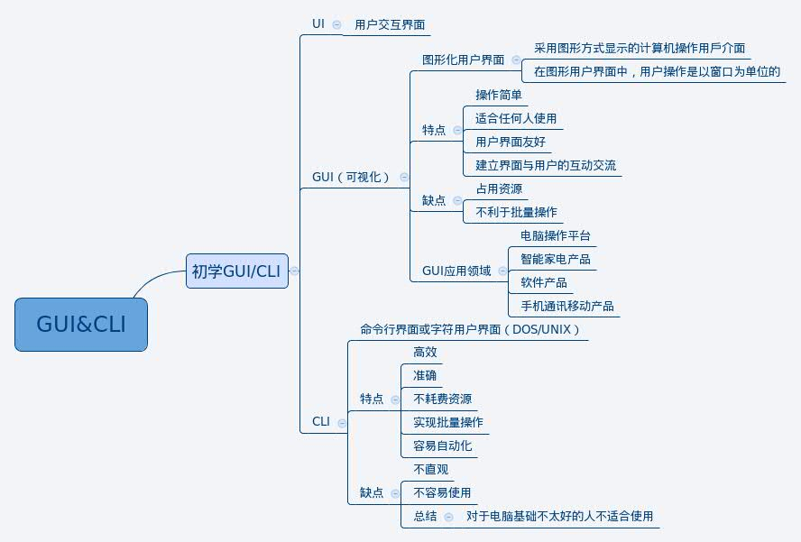

#GUI/CLI学习笔记
##一、GUI

###1、定义
GUI——Graphical User Interface，图形用户界面。

###2、特点
用户界面的所有元素图形化，主要使用鼠标作为输入工具，点击图标执行程序，使用按钮、菜单、对话框等进行交互，追求易用，看起来比较美观，而且任何人都能快速上手使用。
GUI由于采用了大量的图形元素，界面会更显得具有艺术性，富有人性化。相较于枯燥的文本来说，精致且合理的图形大大增强了界面的易用性。

###3、GUI的哲学
##**以下摘自博客网
GUI是为了使操作直观而生，最初被苹果公司应用在其操作系统上。后来苹果公司更是大胆率先采用鼠标作为输入设备，从而进一步使得电脑操作更为直观和易用。不过在那个年代受限于硬件的机能，更由于苹果一贯的高价策略，GUI长期被视为一种不必要的“奢侈品”，直到微软的“平民系统”Windows出现，在大量抄袭了苹果系统的图形元素后，Windows成功地在低端市场蔓延开来，GUI才终于得以大行其道。从这点上来说，微软公司还是起到了很积极的作用，对计算机的平民化和易用化作出了不小的贡献。

GUI的设计目标就是为了摆脱CLI的弊病，把软件的输入和输出都以更为人性化的形式来展现，从而使得软件更为易用和直观。从这种意义上来说，GUI的出现，可以看作是一种“进步”。通过提供一组图形“控件”，用户得以以更为自然的方式与计算机进行互动。通过简洁明了的图标，用户可以对软件的功能一目了然。通过使用新的输入设备——鼠标，用户可以以更符合人类习惯的方式“Point & Click”，舒服地向计算机传递各种指令。不难想象，GUI的出现对于计算机的发展来说，不啻于一场伟大的革命。

GUI软件可以通过使用大量的图形元素和图形特效，从根本上改变软件的表现形式，“美观”和“人性化”渐渐成为软件界面设计的讨论主题。随着计算机处理能力的发展，我们甚至能够以3D的形式来呈现和操作软件。大量GUI软件的出现大大降低了学习和使用计算机的门槛，赏心悦目的操作界面吸引了各行各业的人投入其中。如果说CLI适应了各种各样的计算机，GUI则适应了各种各样的人。可以说，要是没有GUI，也就没有今天如此繁盛的计算机产业。GUI的出现顺应了人们的需求，也是历史的必然。

然而无论多么精美的界面，电脑程序就是电脑程序，其本质上却还是需要通过“命令”传递给计算机才能发挥作用的。由于中间需要进行“人的习惯”到“计算机的习惯”的转换，GUI软件不可能做到如CLI软件一般的高效和精确。可以说，GUI避免了CLI的弊端，但CLI的优点却恰恰成为了GUI的缺点。

由于大量图形元素的使用，GUI软件带动了计算机硬件的发展，人们对良好界面的追求推动了计算机处理能力的飞速发展。但这同时也说明GUI软件对计算机硬件的依赖性很强，在需要将GUI软件移植到其他平台时，这种依赖性的弊端就会凸现出来。而且即使是在同一平台上，GUI软件所耗费的资源要比相同功能的CLI软件高得多，但所能达到的性能则要低得多。尽管GUI提供了良好的易用性，极大地填补了人机对话的鸿沟，但在另一方面看来，实际上增加了软件开发的成本，缩小了软件的适用范围，同时降低了软件的工作性能。

由于能够以非常灵活的方式进行设计，GUI软件的表现形式也是千差万别。这本来是件好事情，但由于存在太多的GUI设计方式，开发人员在设计复杂的GUI软件时往往会陷入一种无所适从的困境。为了设计出真正易用好用的GUI软件，开发商往往不得不求助于艺术家和心理学家，甚至不惜采用“仿真”的方式来设计软件界面，这大大增加了软件开发的成本。尽管因此带动了计算机图形学和人机界面设计学的发展，但更多的“无良”开发商基于成本的考虑，选择了滥竽充数得过且过，无视用户的操作习惯和软件的易用性，甚至创造出一些难以使用的“GUI”，企图用更符合自身利益的界面设计来“改善”用户本身自然的“习惯”和“体验”，如上面所提到的那个著名的GUI软件。以操作系统开发商为例，可以说，如今最能坚守易用性阵地的当属苹果公司。尽管其产品同样存在一些瑕疵，但直到今天，苹果公司仍然坚持发展人机界面设计学，其创造的GUI软件大都是艺术性和易用性结合的典范。而在微软Windows系统横行的国内，在其所推行的“廉价GUI”的理念影响下，能以谨慎的态度学习和应用哪怕是“图标设计学”的人都已经几乎绝迹了。这在实际上导致了部分用户对GUI的反感和抵触。

##二、CLI

###1、定义

CLI——Command Line Interface，命令行界面。

###2、特点

相较于GUI而言，CLI通常就不具备什么美观程度了。为了提高性能，CLI通常采用纯文本方式工作。
用户界面字符化，使用键盘作为输入工具，输入命令、选项、参数执行程序，追求高效，看起来比较酷，是高级程序员的最爱。为了提高工作效率，CLI通常都能够以很自然的方式支持批量操作。

###3、CLI的哲学
##**以下摘自博客网
CLI可以说是人机界面的远祖，哪怕是远古时期的纸带式计算机，也同样需要使用“命令行”方式工作（当然载体不同）。可以说命令行是最符合计算机工作方式的操作方式。

CLI的身上，带有编程的“影子”。各种选项以命令参数的方式传递给系统，我们所需要做的唯一事情就是查阅手册并选择适当的参数，然后用键盘一股脑儿敲进去，然后就是回车并等待执行结果。如前所述，这种操作方式具有很便利的可重复性，我们可以把这条命令保存为一个脚本以供将来直接调用，也可以粘贴到网络上，任何人都能直接复制并粘贴到自己的电脑上执行并得到同样的结果。

由于主要使用文本作为界面，CLI软件对计算机的要求也低得多，在同等配置的机器上也要比GUI软件的性能好得多。也正因此，CLI软件得以在广大的服务器系统上大行其道，在这些系统上，性能是最重要的。同时，由于具备了比GUI软件好得多的可伸缩性，CLI的适用范围也远比GUI广泛，在很多嵌入式平台上，我们甚至只能看到CLI的身影。

但毕竟人不是计算机，符合计算机的工作方式的同时也就意味着不那么人性化。为了用好一个CLI软件，用户不得不反反复复地查阅参数手册，有时还需要做各种参数组合的测试。而且如前所述，对于一些参数复杂的CLI软件，用起来是颇为令人头痛的，甚至有时根本就无法发挥CLI本身应有的“高效”。

另外，对于CLI软件来说，执行结果往往并不是那么清晰的。用户常常不得不面对满屏滚动的反馈信息体验黑客帝国一般的快感，或者是仿效真正的黑客一般从浩瀚的log海洋中寻觅那条丝毫不起眼的提示信息。

有人把CLI软件的工作方式称为“WYTIWYG”（What You Think Is What You Get，所想即所得）。这种方式的特点在于，虽然没有直观地反应出执行结果，但却能保证执行结果可以和你的意图一致。从某种程度上来说，这种说法是正确的，因为用户的意图总是以命令＋参数的方式精确地传递给系统，最后虽然不能直观地看到执行结果，却总能发现系统已经出色并严格地完成了工作。但从某种意义上来说，这种说法是不准确的，因为当面对着长长的参数手册时，用户往往已经搞不清自己的意图到底是什么了。

###**初学GUI/CLI的思维导图

